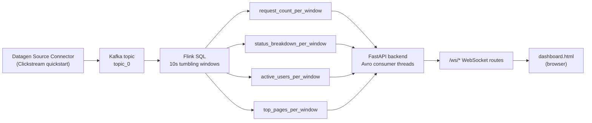

# PulseStream

Real-time traffic observability, end to end: synthetic clickstream events are
ingested, aggregated in 10-second windows with Flink SQL, and streamed to a
live dashboard over WebSockets — no polling, no batch delay.

Built on Confluent Cloud (Kafka + Flink SQL + Schema Registry) for
[Confluent Dev Day](https://www.confluent.io/) — submitted in the "Most
Impactful App" category.

## Why real-time

Most internal dashboards refresh on a delay — a batch job every few minutes,
a page you have to reload. For an SRE or platform team, that delay *is* the
incident: a traffic spike, an error-rate jump, or a burst of unusual activity
sits unnoticed until someone happens to check, or a customer reports it
first.

PulseStream demonstrates the alternative: a pipeline where request volume,
error breakdown, active users, and trending pages update within seconds of
happening, not minutes after. The goal isn't to replace a full observability
platform like Datadog — it's a focused, purpose-built pattern that can run
standalone for lightweight monitoring, or feed into a broader stack via
Datadog's own Kafka integration.

## Architecture



**Stage by stage:**
1. **Ingestion** — Confluent Cloud's Datagen Source Connector, using the
   built-in Clickstream quickstart, generates synthetic web traffic events
   (`ip`, `userid`, `time`, `request`, `status`, `bytes`, `referrer`, `agent`)
   directly into a Kafka topic. No producer code, no external feed to manage.
2. **Stream processing** — Flink SQL runs four windowed queries over 10-second
   tumbling windows, each answering one dashboard question: request volume,
   status-code breakdown, distinct active users, and top-5 requested pages.
3. **Serving boundary** — each query is saved as a **materialized table**,
   which is itself a real Kafka topic backed by an Avro schema in Schema
   Registry. The backend never re-runs SQL or talks to Flink directly — it
   just consumes these four topics like any other Kafka consumer.
4. **Backend** — a FastAPI service runs one Kafka consumer thread per topic
   (Avro deserialization via Schema Registry), bridges each incoming record
   into the async event loop, and fans it out to any browser connected to
   that topic's WebSocket route.
5. **Frontend** — `dashboard.html` is a single self-contained page (no
   framework, no build step) that opens four WebSocket connections and
   renders live bar charts, a status breakdown, an active-users sparkline,
   and a ranked top-pages table.

## Tech stack

| Layer | Technology |
|---|---|
| Ingestion | Confluent Cloud Datagen Source Connector (Clickstream quickstart) |
| Stream processing | Flink SQL (windowed aggregation, Top-N pattern) |
| Serving layer | Confluent Cloud materialized tables, Avro + Schema Registry |
| Backend | Python, FastAPI, `confluent-kafka` (Avro consumer), WebSockets |
| Frontend | Vanilla HTML/CSS/JS, Canvas-drawn charts (no external chart library) |

## Key engineering decisions

- **Windowing on `$rowtime`, not `PROCTIME()`.** Confluent Cloud's managed
  Flink dialect exposes a built-in system time-attribute column
  (`$rowtime`) on topic-backed tables, already watermarked. Manually
  creating a processing-time column via `PROCTIME()` is rejected by the
  dialect — worth knowing if you're used to vanilla Flink SQL.
- **Materialized tables as the serving boundary.** Rather than have the
  backend query Flink or hold aggregation logic itself, each windowed query
  is saved as a materialized table — a real, independently consumable Kafka
  topic. This keeps the backend a thin, generic Kafka consumer with zero
  knowledge of the SQL that produced its data.
- **Avro end to end.** Despite the source topic being `JSON_SR`, materialized
  tables are backed by Avro schemas in Schema Registry — the backend's
  consumer uses `AvroDeserializer` against Schema Registry, not raw JSON
  parsing.
- **Thread-per-topic, bridged into asyncio.** `confluent-kafka`'s consumer
  is blocking and not async-compatible, so each of the four topics gets its
  own background thread running a blocking consume loop; each thread
  forwards messages into FastAPI's event loop via
  `asyncio.run_coroutine_threadsafe`, which then fans out to connected
  WebSocket clients.
- **Least-privilege service account.** The backend authenticates with a
  dedicated `dashboard-backend-reader` service account — separate from the
  Datagen connector's own account — scoped with READ-only ACLs on exactly
  the four materialized-table topics and one consumer group, rather than
  reusing a broader, pre-existing credential.
- **Client-side windowing on the frontend.** `status_breakdown_per_window`
  and `top_pages_per_window` emit one row per status code / per top-5 page
  per window, not one combined row. `dashboard.html` groups incoming
  messages by `window_start` client-side to reconstruct a full snapshot per
  window before rendering.

## Demo

> **TODO:** add a real screenshot or short GIF of `dashboard.html` running
> end to end here once it's been recorded (e.g. from a network that isn't
> blocking outbound Kafka traffic on port 9092).

To preview the UI without Confluent access, open
`backend/static/dashboard.html?demo` — directly from disk or via the running
backend. Demo mode feeds synthetic windows through the same rendering code
and labels the status indicator "Live · demo data"; without `?demo`, the page
only shows real WebSocket data.

## Setup and run

**1. Confluent Cloud (already configured for this project):**
- Datagen Source Connector, `quickstart: CLICKSTREAM`, output topic `topic_0`
- Four Flink SQL windowed queries, each saved as a materialized table:
  `request_count_per_window`, `status_breakdown_per_window`,
  `active_users_per_window`, `top_pages_per_window`
- A dedicated `dashboard-backend-reader` service account with READ ACLs on
  those four topics plus the `dashboard-backend-group` consumer group, and a
  separate Schema Registry API key

**2. Backend:**
```bash
cd backend
python -m venv venv
source venv/bin/activate   # Windows Git Bash: source venv/Scripts/activate; PowerShell: venv\Scripts\activate
pip install -r requirements.txt
```

Create a `.env` file (copy `.env.example` and fill it in):
```
BOOTSTRAP_SERVERS=<your bootstrap server>
KAFKA_API_KEY=<your Kafka API key>
KAFKA_API_SECRET=<your Kafka API secret>
SCHEMA_REGISTRY_URL=<your Schema Registry URL>
SCHEMA_REGISTRY_API_KEY=<your Schema Registry API key>
SCHEMA_REGISTRY_API_SECRET=<your Schema Registry API secret>
CONSUMER_GROUP=dashboard-backend-group
```

Run it:
```bash
uvicorn main:app --reload --reload-exclude venv
```

**3. Dashboard:**
Open `http://localhost:8000/static/dashboard.html` — all four panels should
move from "waiting for data" to live values within one or two 10-second
windows.


> **Note:** outbound connections to Confluent Cloud use port 9092
> (SASL_SSL). Some corporate networks block this port — if the backend
> can't reach Confluent, try a different network (home Wi-Fi, mobile
> hotspot) to confirm.

## Possible extensions

The Kafka → Flink → materialized table → WebSocket pattern built here isn't
specific to clickstream data — the same shape applies directly to:
- **Fraud detection** — replace clickstream events with transaction events,
  window on velocity/amount anomalies instead of status codes
- **Inventory alerting** — replace with inventory change events (CDC via
  Debezium), window on stock-level thresholds instead of request counts
- **Fleet monitoring** — replace with vehicle telemetry, window on
  geofence/speed/status instead of page hits

Each reuses the same four pieces — ingestion connector, windowed Flink SQL,
materialized tables as the serving boundary, and a generic WebSocket
fan-out — with a different data source and a different set of queries.
